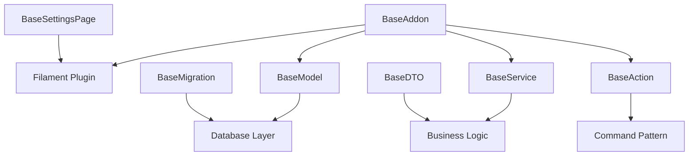

# Base Classes

The Base classes in Filament Twist provide foundational functionality for building addons, models, services, and other components. These abstract classes establish consistent patterns and shared functionality across the framework.

## Overview

Filament Twist includes several base classes:

- **[BaseAddon](./base-addon)** - Foundation for all addons
- **[BaseModel](./base-model)** - Enhanced Eloquent model with Twist integration
- **[BaseMigration](./base-migration)** - Migration base with automatic table prefixing
- **[BaseService](./base-service)** - Service pattern implementation
- **[BaseAction](./base-action)** - Command pattern with automatic tracking
- **[BaseDTO](./base-dto)** - Data Transfer Object with serialization
- **[BaseSettingsPage](./base-settings-page)** - Filament settings page foundation

## Architecture Overview

The base classes follow a consistent pattern and work together to provide a unified development experience:



## Best Practices

### 1. Service Layer Architecture

```php
// Use services for business logic
class UserManagementAddon extends BaseAddon
{
    public function boot(Panel $panel): void
    {
        $panel->resources([
            UserResource::class,
        ]);
    }
}

// Keep business logic in services
class UserService extends BaseService
{
    public function createUser(UserDTO $userData): User
    {
        return CreateUserAction::make($userData->toArray());
    }
}
```

### 2. Consistent Naming

```php
// Follow naming conventions
class CreateUserAction extends BaseAction { }  // Actions end with "Action"
class UserService extends BaseService { }      // Services end with "Service"
class UserDTO extends BaseDTO { }              // DTOs end with "DTO"
```

### 3. Interface Implementation

```php
// Implement relevant interfaces
class UserManagementAddon extends BaseAddon implements 
    HasMigration, 
    HasRouteApi 
{
    // Implementation
}
```

### 4. Configuration Awareness

```php
// Respect Twist configuration
class UserModel extends BaseModel
{
    // Automatically uses Twist prefixes and connections
}

class CreateUsersTable extends BaseMigration
{
    // Automatically applies table prefixes
}
```

## Integration Examples

### Complete Addon Structure

```php
// Addon class
class UserManagementAddon extends BaseAddon implements HasMigration
{
    public function boot(Panel $panel): void
    {
        $panel->resources([UserResource::class]);
    }

    public function pathMigrations(): string
    {
        return __DIR__ . '/Database/Migrations';
    }
}

// Model
class User extends BaseModel
{
    protected $fillable = ['name', 'email'];
}

// Service
class UserService extends BaseService
{
    public function createUser(UserDTO $data): User
    {
        return CreateUserAction::make($data->toArray());
    }
}

// Action
class CreateUserAction extends BaseAction
{
    public function handle(array $userData): User
    {
        return User::create($userData);
    }
}

// DTO
class UserDTO extends BaseDTO
{
    public function __construct(
        public string $name,
        public string $email
    ) {}
}

// Migration
class CreateUsersTable extends BaseMigration
{
    public function up(): void
    {
        Schema::create($this->prefix . 'users', function (Blueprint $table) {
            $table->id();
            $table->string('name');
            $table->string('email')->unique();
            $table->timestamps();
        });
    }
}
```

## Next Steps

- [Learn about Addon Interfaces](../addon-interfaces)
- [Explore TwistClass API](../twist-class)
- [See complete examples](../../examples/)